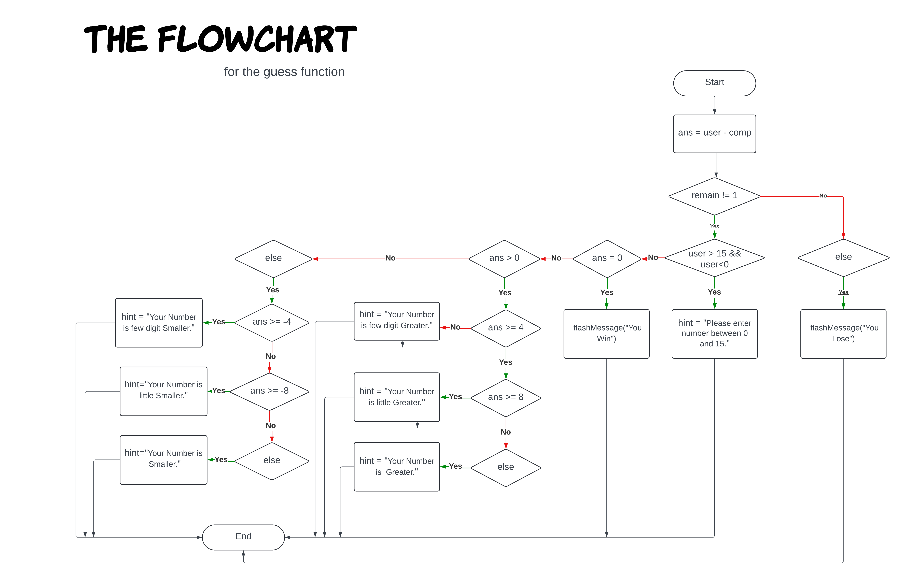

# How it is works?
## variables
It has some main variables:

1. `self.comp`: This variable holds the secret number randomly generated by the computer. It's the number you're trying to guess!
1. `self.user`: This variable acts as a temporary storage for the number you enter as your guess.
1. `self.chances`: This variable represents the total number of attempts you have to guess the correct number. Use your tries wisely!
1. `self.remain`: This variable keeps track of your remaining chances after each guess. Make every guess count!
1. `self.hint`: This variable stores a clue based on your guess. It guides you closer to the secret number with hints like "higher," "lower," or "getting close!"

In the _\_init__ function, there are some variables

1. `self.mainfrm`: It is the CTkFrame Widget. it is the most import widget of this Gui.It is the father of many other Widgts

1. `lb1`:It is label basically Its role is that of heading.

1. `lb2`:It is the messenger. Its role is that of inform the user to guess number between 0 and 15

1. `en1`: It is the input widget. It provides area to user for enter the number

1. `frm1`: It is frame that have 2 labels. Its role is that of give the information to user that how many tries he have and how many are remain?

- `lb3`: it is label. It represents that how many chances user have.
- `lb4`:It is label. It represents that how many chances are remain.

1`lb5`:It is label and It shows the hint

## Guess function
It calls when the button pressed,here is the flowChart that represent how guess function works.

### Flowchart Logic:

* **Start:** The process begins at the "Start" point.
* **ans = user:** The flowchart prompts the user to input a number, which is stored in the variable "ans."
* **remain = 1:** A variable named "remain" is initialized with the value 1. This variable will likely be used to track the number of remaining guesses.
* **First Decision Point:** The flowchart checks if "ans" is greater than 0.
  * If "ans" is greater than 0, the flow proceeds to the left branch.
  * If "ans" is not greater than 0, the flow proceeds to the right branch.
* **Left Branch (ans > 0):**
  * **Second Decision Point:** The flowchart checks if "ans" is greater than or equal to 4.
    * If "ans" is greater than or equal to 4, the flow proceeds to the left branch.
    * If "ans" is not greater than or equal to 4, the flow proceeds to the right branch.
  * **Left Branch (ans >= 4):**
    * The flowchart displays a "flashMessage" indicating that the user wins.
  * **Right Branch (ans < 4):**
    * **Third Decision Point:** The flowchart checks if "ans" is greater than or equal to 8.
      * If "ans" is greater than or equal to 8, the flow proceeds to the left branch.
      * If "ans" is not greater than or equal to 8, the flow proceeds to the right branch.
    * **Left Branch (ans >= 8):**
      * The flowchart displays a "hint" that the user's number is little greater.
    * **Right Branch (ans < 8):**
      * The flowchart displays a "hint" that the user's number is greater.
* **Right Branch (ans <= 0):**
  * **Second Decision Point:** The flowchart checks if "ans" is equal to 0.
    * If "ans" is equal to 0, the flow proceeds to the left branch.
    * If "ans" is not equal to 0, the flow proceeds to the right branch.
  * **Left Branch (ans == 0):**
    * The flowchart displays a "hint" that the user's number is few digit smaller.
  * **Right Branch (ans < 0):**
    * **Third Decision Point:** The flowchart checks if "ans" is greater than or equal to -4.
      * If "ans" is greater than or equal to -4, the flow proceeds to the left branch.
      * If "ans" is not greater than or equal to -4, the flow proceeds to the right branch.
    * **Left Branch (ans >= -4):**
      * The flowchart displays a "hint" that the user's number is little smaller.
    * **Right Branch (ans < -4):**
      * The flowchart displays a "hint" that the user's number is smaller.
* **End:** The process ends at the "End" point.

## flash_Message function
There are some variables here
1. `frm3`:It is frame. Basically it is second window, when user lose or win it pop up and `self.mainfrm` unpack

1. `lb6`:It is label. Its shows the Message that you Lose or Win

1. `frm4`: It is Frame. It has 2 Button
- `btn2`:When it is pressed so It restart the game`
- `btn3`: When it is pressed so game's window close

### restart_game function
It reset all variables value to initial value